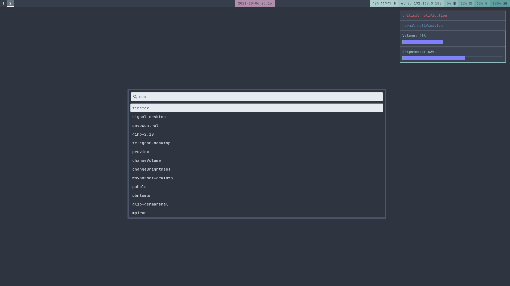
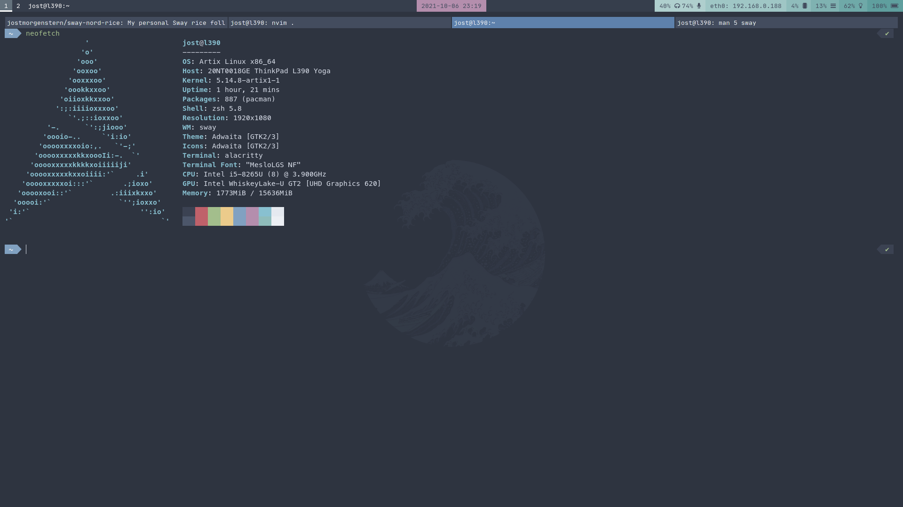
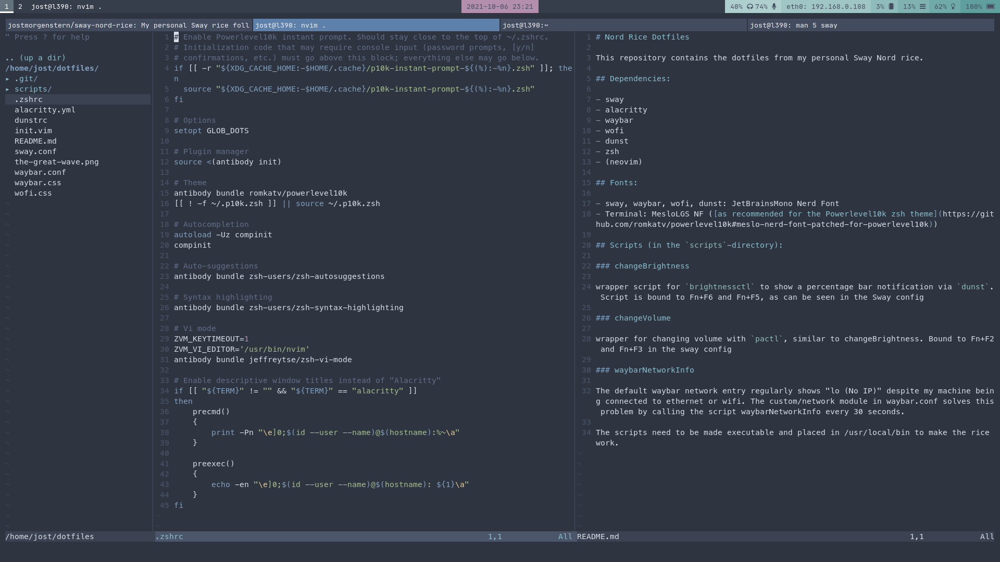

# Nord Rice Dotfiles

This repository contains the dotfiles from my personal Sway Nord rice.

## Dependencies: 

- sway
- alacritty
- waybar
- wofi
- dunst 
- zsh 
- (neovim)

## Fonts:

- sway, waybar, wofi, dunst: JetBrainsMono Nerd Font
- Terminal: MesloLGS NF ([as recommended for the Powerlevel10k zsh theme](https://github.com/romkatv/powerlevel10k#meslo-nerd-font-patched-for-powerlevel10k))

## Scripts (in the `scripts`-directory):

### changeBrightness

wrapper script for `brightnessctl` to show a percentage bar notification via `dunst`. Script is bound to Fn+F6 and Fn+F5, as can be seen in the Sway config 

### changeVolume

wrapper for changing volume with `pactl`, similar to changeBrightness. Bound to Fn+F2 and Fn+F3 in the sway config

### waybarNetworkInfo

The default waybar network entry regularly shows "lo (No IP)" despite my machine being connected to ethernet or wifi. The custom/network module in waybar.conf solves this problem by calling the script waybarNetworkInfo every 30 seconds.

The scripts need to be made executable and placed in /usr/local/bin to make the rice work.

